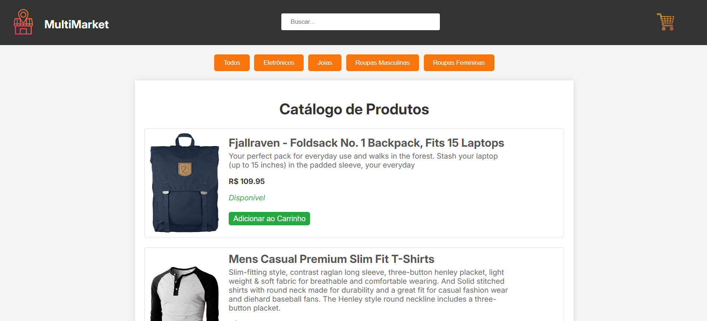

# 🛒 Loja Online

 

## 🖥️ Descrição

Este projeto é uma loja online simples onde você pode explorar um catálogo de produtos, adicionar itens ao carrinho, e realizar a compra. Inclui funcionalidades como pesquisa de produtos, filtragem por categoria e exibição de resumos de pagamento.

## 🔎 Funcionalidades

- **Catálogo de Produtos:** Visualize uma lista de produtos com imagem, descrição, preço e disponibilidade.
- **Busca de Produtos:** Filtre os produtos pelo nome usando um campo de pesquisa.
- **Adição ao Carrinho:** Adicione produtos ao carrinho e ajuste a quantidade até o limite máximo.
- **Visualização do Carrinho:** Veja os itens no carrinho, o total do carrinho e remova itens se necessário.
- **Login e Pagamento:** Faça login e finalize a compra com um resumo detalhado, incluindo custo de frete.
- **Exibição de Modal:** Modais para login, carrinho e pagamento.

## 🚀 Tecnologias Utilizadas

- HTML
- CSS
- JavaScript
- API de Produtos: [Fake Store API](https://fakestoreapi.com/products)
- API de CEP: [ViaCEP](https://viacep.com.br/ws/)

## 🎨 Estrutura dos Arquivos

- `index.html`: Página principal da loja.
- `styles.css`: Arquivo de estilos CSS.
- `script.js`: Lógica JavaScript para manipulação da loja.
- `README.md`: Documentação do projeto.

